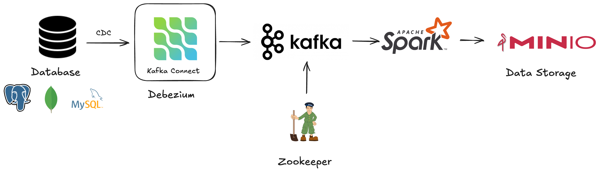
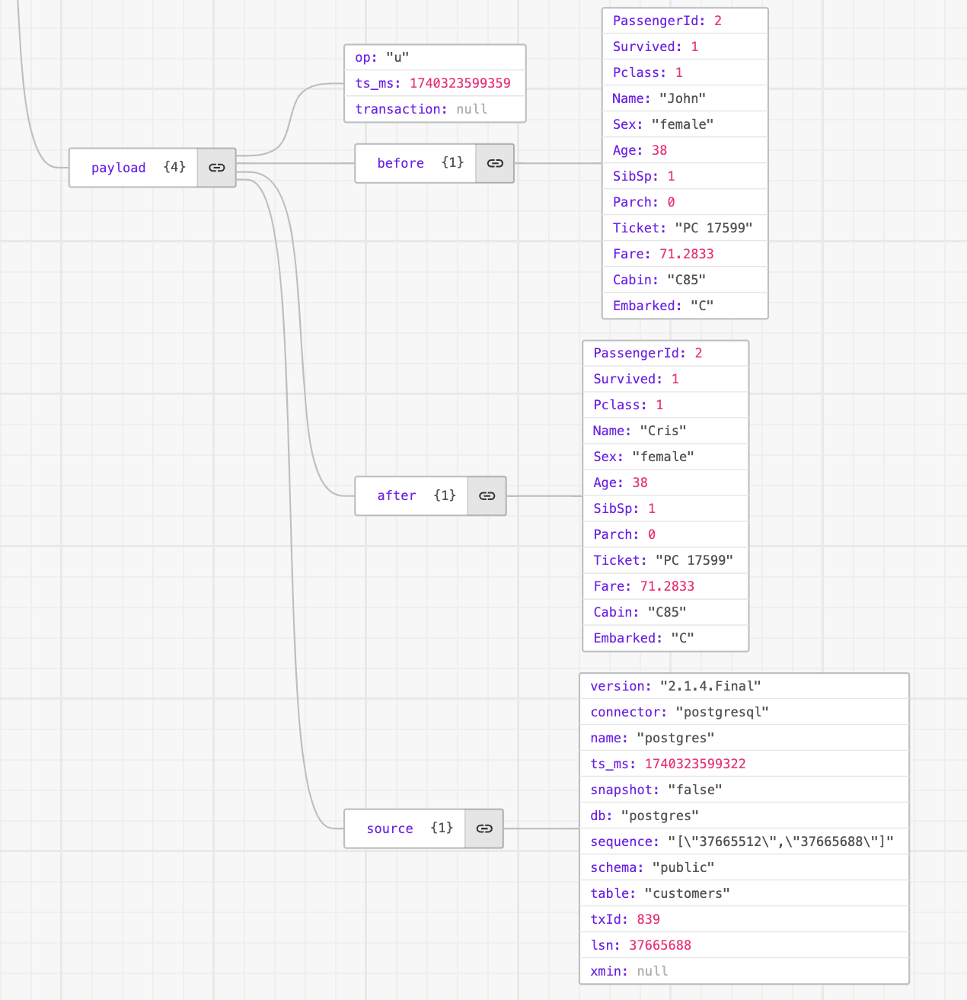

# End-to-end data streaming project with PostgreSQL, Debezium, Kafka, Spark Streaming and MinIO
## Introduction
In today’s data-driven world, real-time data streaming is crucial for making instant decisions, especially in systems handling large amounts of data, such as IoT systems, transactional systems, clickstream, application logs... Traditional batch processing methods often fall short in handling rapidly changing data, leading to latency issues and outdated insights. This is where Change Data Capture (CDC) comes into play - allowing systems to capture and propagate data changes efficiently.

In this article, I will walk through an end-to-end data streaming project that leverages CDC with PostgreSQL, Debezium, Kafka, Spark Streaming, and MinIO. The goal is to capture real-time changes from a PostgreSQL, database, stream them through Kafka, process the data with Spark Streaming, and store it efficiently in MinIO for further analysis or downstream applications.

I will explore the following contents:

- How CDC enables real-time change tracking in PostgreSQL
- The role of Debezium in capturing and forwarding changes
- How Kafka acts as a central event streaming platform
- The use of Spark Streaming to process and transform real-time data
- How MinIO provides scalable object storage for processed data
## Architecture

The components in the above architecture include:
- **PostgreSQL**: Stores relational data and captures changes using CDC.
- **Debezium**: Listens for database changes, converts them into event streams, and publishes them to Kafka.
- **Kafka**: Acts as a real-time pipeline, ensuring reliable message distribution.
- **Spark Streaming**: Processes and transforms real-time data from Kafka.
- **MinIO**: Provides scalable object storage for processed data.
## Implementation
### 1. Setup Docker Compose
Step 1: Create [docker-compose.yaml](./docker-compose.yaml) file

Step 2: Run the Docker Compose file using the following command:

```sh
docker-compose up --build -d
```
*— build flag ensures that docker compose builds the images for services*
### 2. Configure Debezium PostgreSQL Connector
After setting up the services, configure the Debezium PostgreSQL Connector to capture changes from the database and publish them to Kafka.

Step 1: Create configuration file name [debezium-postgresql-connector.json](./debezium-postgres-connector.json) with following content:

*For a clear understanding of Debezium connector for PostgreSQL, I recommend checking out its official documentation at [Debezium PostgreSQL Connector](https://debezium.io/documentation/reference/stable/connectors/postgresql.html)*

Step 2: Use the following `curl` command to create a PostgreSQL CDC connector via a POST request to the REST API:
```sh
curl -i -X POST -H "Accept:application/json" -H  "Content-Type:application/json" <http://localhost:8083/connectors/> -d @debezium-postgres-connector.json
```
### 3. Generate Postgres Data
Step 1: Download data source

Data source link: https://raw.githubusercontent.com/datasciencedojo/datasets/master/titanic.csv

Using the following command to download the data source:
```sh
wget <https://raw.githubusercontent.com/datasciencedojo/datasets/master/titanic.csv> -O customers.csv
```
Step 2: Insert data in to PostgreSQL

To load customers csv file to PostgreSQL, using [csv_to_postgresql.py](./csv_to_postgresql.py) with command:
```sh
python csv_to_postgresql.py
```
Step 3: Check the data in PostgreSQL using the psql command:

To enable full data tracking for a specific table, use the following command:
```sh
ALTER TABLE customers REPLICA IDENTITY FULL;
```
> With **REPLICA IDENTITY FULL**, when an UPDATE or DELETE operation occurs, PostgreSQL will retain the entire "before" image of the row, which allows CDC tools like Debezium to correctly capture and propagate changes.
### 4. Stream and Verify Data in Kafka
Once the connector is active, verify that Kafka topics are receiving CDC events.

Step 1: List Kafka topics
```sh
docker exec -it kafka kafka-topics.sh --list --bootstrap-server kafka:9092
```
Step 2: Consume topic to read messages from Kafka broker

If topic.prefix is postgres and **table.include.list** is **public.customers**, the corresponding Kafka topic will be **postgres.public.customers**.
```sh
docker compose exec kafka /kafka/bin/kafka-console-consumer.sh --bootstrap-server kafka:9092 --from-beginning --property print.key=true --topic postgres.public.customers
```
Step 3: Update or delete one record in the database by running this command:
```sh
UPDATE customers SET "Name" = 'Cris' WHERE "PassengerId" = 2;
DELETE FROM customers WHERE "PassengerId" = 3;
```
After updating a record in the PostgreSQL terminal, you can view the result in the Kafka consumer terminal.
You can use [json.crack](https://jsoncrack.com/editor) to inspect the message values, allowing you to see the before-and-after changes in the data.

### As you can see:

- `before`: Contains the record before the change; this field will be `null` for INSERT operations.
- `after`: Contains the record after the change; this field will be `null` for DELETE operations.
- **`op` (Operation): Indicates the type of database operation.

**Possible values:**
- `"c"` → Create (INSERT)
- `"u"` → Update (UPDATE)
- `"d"` → Delete (DELETE)
- `"r"` → Read (SNAPSHOT - only during snapshot mode)

- `ts_ms` (Timestamp): The epoch timestamp (in milliseconds) representing when the event occurred.
### 4. Process Data with Spark Streaming & Store in MinIO
Step 1: Write python script to process data with Spark Streaming and store in MinIO
The [stream_kafka_to_minio.py](spark_client/src/stream_kafka_to_minio.py) file is used to subscribe to data from a Kafka topic, process it with Spark Streaming, and load it into MinIO in CSV and Parquet formats.

Step 2: Run spark submit command to call this job
```bash
spark-submit --master local --packages org.apache.spark:spark-sql-kafka-0-10_2.12:3.4.1,io.delta:delta-core_2.12:2.4.0 stream_kafka_to_minio.py
```
## **Conclusion**

This architecture provides a **real-time, scalable data pipeline** that ensures efficient **data ingestion, processing, and storage**.

✔ **Debezium & Kafka** capture database changes in real-time  
✔ **Spark Streaming** processes and transforms data dynamically  
✔ **MinIO** serves as a **Data Lake**, storing raw and processed data  

### **When to Use?**  
✅ **Real-time analytics & monitoring** (e.g., industrial IoT, financial transactions)  
✅ **Event-driven architectures** requiring instant data updates  
✅ **Big data processing & machine learning pipelines**  

This setup is ideal for organizations needing **low-latency, high-throughput data processing** while ensuring **scalability and cost-efficiency**. 💪


